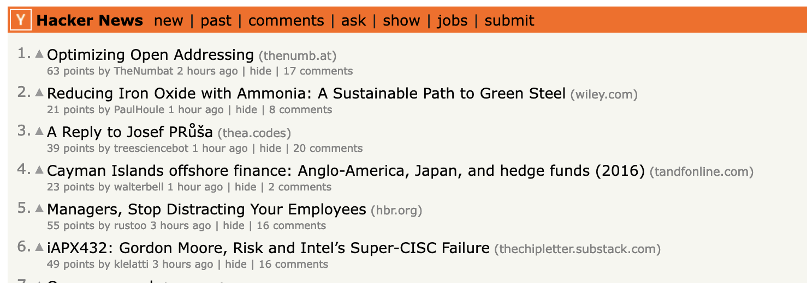
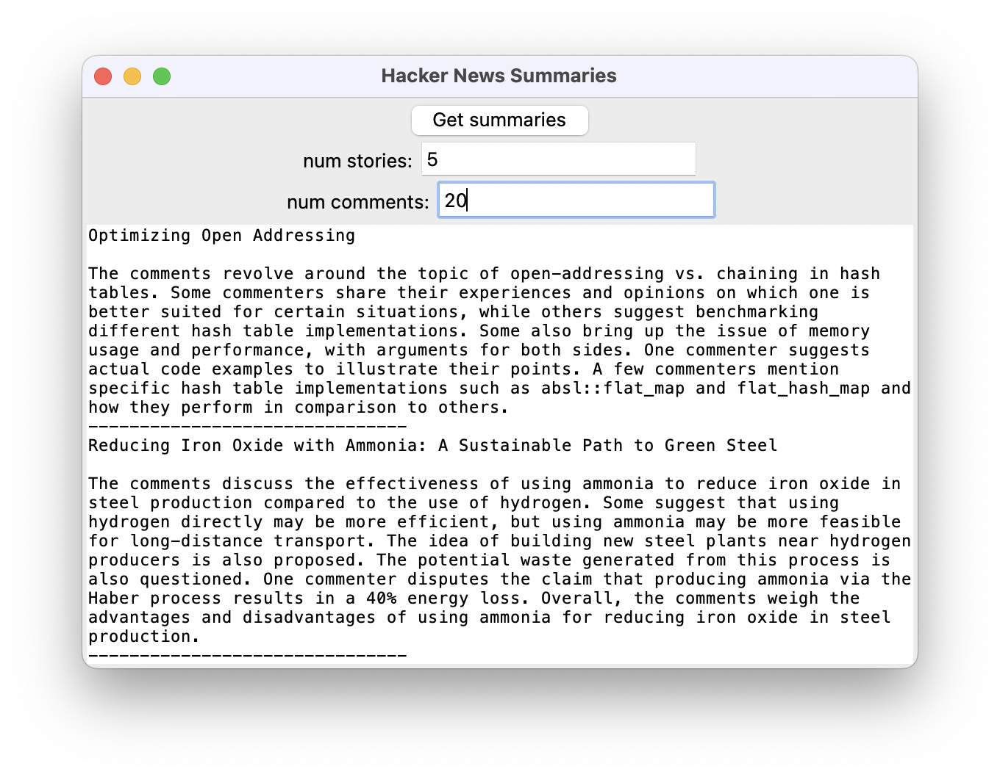

# hn-summaries

This is a simple Python project that scrapes the comments of top hackernews posts and displays summarizes them using GPT-3.5 OpenAI API.





## Features

- Fetch a specified number of top posts from Hacker News.
- Parse all the comments and summarize the using GPT-3.5.
- Display the titles and comment summaries in a simple GUI using tkinter.

## Installation

1. Clone the repository:

```bash
git clone https://github.com/filipmrc/hn-summaries.git
```

2. Install the required packages:

```bash
pip install -r requirements.txt
```

**Note:** If you're using a standard Python installation, the `tkinter` package should already be included. However, if you're using a Python distribution that doesn't include `tkinter` by default (such as some Linux distributions), you might need to install it separately.

## Usage
1. Set the OPENAI_API_KEY env variable to your API key

```bash
export OPENAI_API_KEY="<your key here>"
```

2. Run the script:

\```bash
python scraper.py
\```

3. Enter the number of posts you want to fetch in the "num posts" entry field. 

4. Enter the number of comments you want to use for the summary in the "num comments" field.

5. Click the "Get summaries" button to display the titles in the text area below.

## License

This project is released under the MIT License. See the [LICENSE](LICENSE.txt) file for details.

